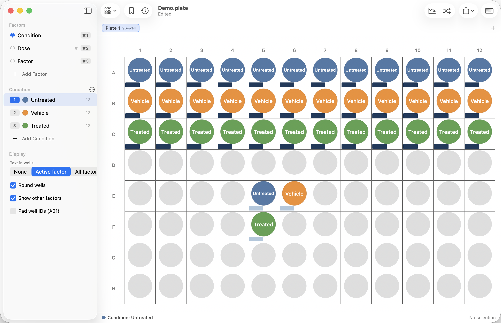

# pLayout

A native macOS editor for microplate layouts. Pick a condition with a number key,
drag across wells to paint it, and export a spreadsheet that Excel, Prism, R or
pandas can read directly.

Supports 6, 12, 24, 48, 96, 384 and 1536-well plates, plus any custom size you
define.



## Build

```sh
./build.sh
open "build/pLayout.app"
swift test          # the full suite, 500+ tests
```

Swift Package Manager, no third-party dependencies. Requires macOS 14 or later.

Like other document-based Mac apps, it opens a file picker at launch — `⌘N`, or
the **New Document** button in that panel, starts an empty 96-well plate.

## Install without building

Each release on the [releases page](https://github.com/nettilor/pLayout/releases)
carries a ready-made `pLayout-x.y.dmg` for macOS 14 or later, Apple Silicon and
Intel both. Open it, drag pLayout into Applications, and follow the three steps
drawn in the window: macOS blocks the first launch because the app is not
notarized (that needs a paid Apple developer account). Click **Done** rather
than *Move to Trash*, open **System Settings → Privacy & Security**, scroll
down, and press **Open Anyway**. It is asked for once, and never again.

`Tools/make_dmg.sh` is what packages a release — a universal build in a disk
image whose window carries those instructions.

**Windows:** the same releases page carries `pLayout-x.y.z-windows.zip`, a build
of the Python/PySide6 port in `python_port/` (same `.plate` files, same exports —
see [`python_port/README.md`](python_port/README.md)). Unzip it anywhere and run
`pLayout.exe`; the first launch shows SmartScreen because the build is not signed —
click **More info → Run anyway**, once. Nothing needs installing.

Once installed, pLayout notices new releases by itself: at most once a day it
asks this repository's releases feed whether a newer version exists, silently
unless there is one — and never says a word offline. When one exists it offers
to fetch the DMG into your Downloads folder and open it, ready to drag into
Applications; nothing is ever installed behind your back. **Check for
Updates…** in the pLayout menu asks on demand, and **Check for Updates
Automatically** beside it turns the daily look off. That check is the only
network request the app ever makes.

## The model: factors, not just labels

Most plate maps have more than one variable. A document holds a list of **factors**
(Cell line, Drug, Dose, Timepoint…), each with its own colour-coded **levels**. You
paint one factor at a time, and every well keeps a value for each of them.

With a single factor it behaves exactly like a simple condition painter.

Every factor takes an optional **unit** — µM, h, ng/mL, cells/well — under its name in
the sidebar. It changes nothing on the plate; it travels into the export headings, so
a `Dose` column arrives as `Dose (µM)` in the Wells sheet, the tidy CSV and the legend.
Leave it blank and the name is used on its own.

In the sidebar, a **single click** on a factor or condition selects it — anywhere on
the row, including the name — and a **double click** on the name renames it. Escape
abandons a rename, Return or clicking away keeps it. A **`⌘`-click** selects several
rows at once for deleting together (right-click → Delete); painting stays off until
a single row is selected again. **Resting the mouse on a condition row spotlights
it** — every other well dims, so finding one condition on a 384 or 1536 takes a
glance rather than a search.

### How much each well shows

**Display → Text in wells** in the sidebar has four settings:

| Setting | What a well shows |
| --- | --- |
| None | Colour only |
| Active | The active factor's value, filling the well (the default) |
| All | One labelled line per factor, stacked |
| Overview | Every factor at one size on a plain well, nothing selected |

In **All** the lines follow the order of the factor list — drag factors in
the sidebar to reorder them — each headed by a block of that level's colour,
with a key under the plate naming the order. The well itself stays a plain neutral
tile, the same one Overview uses, so no factor's colour drowns the others'. The line
for the factor you are currently painting is called out three ways — a band across
the row tinted with its value's colour, a larger block with a heavier outline, and
larger bold text — so every well says what a click would change; switching factors moves
the emphasis. If the active factor did not
fit as a line, no line is promoted rather than a different one being claimed. A
factor with no value in a well keeps
its slot, so line 2 means the same factor in every well and a blank reads as a blank
rather than a shifted line. Wells are drawn as rounded squares in this mode because
circles waste the width the text needs. Factors that do not fit at the current well
size fall back to the colour strip along the bottom, so nothing is silently dropped.

**Overview** (`⇧⌘O`) is the same stack with the design read rather than edited. No
line is treated as the headline — none carries a band, and all of them share one size
and weight — so the only colour in the plate is the rails. Choosing it also deselects
the factor you were
painting: nothing is armed, clicking selects wells without changing them, and an edit
says so rather than quietly doing nothing. Click any factor, press `⇧⌘O` again, or
pick another setting to go back to exactly what you were doing.

**Group identical wells** is Overview's own checkbox. It draws a line round each run
of wells that share the same conditions, so a plate reads as the blocks it was
designed as rather than as a field of stacked text. The line follows the run itself,
so an L-shaped block gets an L, and the same condition in two corners of the plate
gets two outlines rather than one rectangle swallowing everything between them. Wells
with no values at all are left alone. A picker beside it chooses what has to match:
every factor Overview is showing, or any single one for the coarser view. Colour and
thickness are in Settings; exports ask whether to include the lines, and print takes
the plate as shown.

A factor that only gets in the way there can be left out. An XY imaging position
numbers every well uniquely, so under Overview it boxes each well on its own and
spends a line on a number nobody reads at a glance: right-click it and choose **Hide
in Overview**. The row greys out in the list while Overview is on (an eye-slash marks
it in the other modes), and Overview stacks, keys and groups the plate exactly as if
the factor were not there — which also gives the remaining lines more room. Every
other mode, the hover readout and the exports still carry it. The flag is saved with
the document, and Overview always keeps at least one factor showing.

Both stacking modes supersede the *Show other factors* checkbox, which is therefore
hidden while either is on — the stacked list already accounts for every factor. On a
plate too dense to stack, Overview keeps the first factor as the well's text and drops
the rest to the colour strip, so a 384- or 1536-well design still reads at a glance.

The setting is saved with the document, so a layout reopens — and exports — the
way you designed it.

## Custom plate sizes

**Plate format → Custom Size…** (in the toolbar or the Plate menu) takes any
layout from 1×1 up to 64×96 and previews it as you type. Tick *Save as a template*
to name it and have it appear in the format menu from then on; saved templates are
shared across documents and can be renamed or deleted from the same sheet.

Templates store only the name — a document records its plate as plain dimensions,
so deleting a template never affects a layout that used it.

## Layout templates

**File → Save as Template…** keeps the whole layout — factors, conditions,
plates and their painting — as a starting point, and **File → New from
Template** opens an untitled copy: the recurring assay, set up once. Saving
under an existing name updates that template, and Remove Template lives in
the same submenu. Templates are files of their own, so removing one never
touches a document that started from it.

## Painting

| Input | Action |
| --- | --- |
| `1`–`9`, `0` | Arm condition 1–10 of the active factor |
| `[` / `]` | Previous / next condition |
| `⌘1`–`⌘9` | Switch active factor |
| `⇧⌘O` | Overview — every factor at once, nothing armed; again to go back |
| drag | Paint a rectangle of wells |
| `⌘`-drag | Free-hand brush |
| `⌘`-click | Add or remove one well from the selection |
| `⌘`-drag, nothing armed | Add a rectangle to the selection |
| `⌥`-drag | Erase |
| click `A` or `1` header | Paint a whole row or column |
| click the corner | Turn the plate 90°, and back again (`⇧⌘L`) |
| `⌘A` | Select every well |
| `space` or `F` | Fill the current selection |
| `⌫` | Clear the active factor in the selection (`⌘⌫` or `⇧⌫` clears every factor) |
| `⎋` | Disarm — drag then selects without painting |
| click off the plate | Deselect |
| arrows | Move the cursor; `⇧`-arrows extend the selection |
| pinch | Zoom in; `⌘0` fits the whole plate again |
| `⌥⌘C` / `⌥⌘V` | Copy the selected wells with every factor, and put them down again |
| `⌥⌘P` | Pipetting prep sheet — the tubes and volumes for the drugs on the plate |
| `⇧⌘K` | Canvas — every plate, the prep table and your notes on one board |
| `⌘Z` | Undo (every edit is one step) |

Zoom never goes below "whole plate in view" — that is the resting state, and pinching
only ever moves in closer. The current level shows in the status bar; click it to fit.

## Choosing colours

Clicking a condition's swatch opens a grid that reads in two directions: **across** a
row to tell two conditions apart, **down** a column for the same hue lighter or darker.
The middle row is the colour itself, so a condition the app coloured for you shows up
selected rather than as "custom", and the last column is always a neutral for the
untreated arm.

Three families sit above the grid. **Standard** is the set new conditions are given.
**Colour-blind** is Okabe–Ito, which stays separable with red/green colour blindness —
worth reaching for on anything headed into a figure. **Muted** is softer tints, for a
plate crowded enough that full-strength colour is too loud.

A colour another condition of the same factor already uses is marked with a dot, so a
duplicate is visible before you pick it rather than after. Colours are only compared
within a factor: two factors sharing a blue is harmless, since they never occupy the
same line of a well.

**Custom…** at the bottom opens the system colour picker for anything else, and the
⋯ menu beside the condition list recolours every condition at once — as a spread of
hues, or as a light-to-dark ramp when the factor is numeric.

## Which way up the plate sits

A real plate is wider than it is tall, so that is how a layout opens: a plate entered
as, say, 8 rows of 6 is laid down for you, while a 96-well plate is already that way
round and is left alone.

Clicking the ↻ in the corner where the letters and numbers meet turns the plate a
quarter clockwise, exactly as picking it up and turning it would, and clicking it again
turns it back. `⇧⌘L` does the same.

Because it is a real rotation and not a mirror, **everything travels with the plate**.
Turning clockwise takes A1 from the top-left corner to the top-right, carries the
letters from the left edge to the top — running backwards, A now on the right — and
carries the numbers from the top edge to the right-hand one, exactly where they end up
on a plate you have actually turned. The corner button goes with them, and its arrow
reverses to show the way the next click will turn it. The status bar says where A1 has
ended up.

Nothing about the data moves: every well keeps its id and its values, and the file is
untouched. The orientation is saved with the document and undoable, because exports and
printing render the plate as displayed — so a turned plate exports turned.

## Several plates in one file

The `+` beside the plate tabs adds another plate; the tabs switch between them. A
click selects a plate and a second click on the same tab renames it — the same rule the
factor and condition rows follow. Rename is in the tab's context menu too, alongside
duplicate and delete.

**Saved states belong to a plate, not to the file.** The bookmark saves the plate you
are looking at, the list shows only that plate's states, and reverting puts only that
plate back. Switching plates switches the list, and the bookmark fills or empties to
match the plate you moved to.

Reverting deliberately adds to the factor list rather than replacing it: a state can
put back a condition that has since been deleted, but it will not remove a factor added
afterwards, because another plate may already be painted with it. States saved before
this was true still restore the whole document, and say so in their subtitle.

## Settings (`⌘,`)

How a plate is drawn is partly a matter of taste rather than of the experiment, so
those settings live in the Settings window — **Wells**, **Colours**, **Plate Text** and
**Workspace**, with a live preview below them — and follow you between documents instead
of travelling inside a `.plate` file.

**Text colour** — *Match the well* picks black or white per condition, whichever is
legible. *Always black* and *Always white* use one colour throughout: a label that is
black on some conditions and white on others reads as a glitch to some people rather
than as contrast. Every hue, shade and series step the app offers is light enough to
carry black text, so *Always black* is safe across the palette; only a nearly-black
colour picked from **Custom…** will defeat it. Overview's neutral tile has no colour of
its own to contrast against, so under *Always white* the tile darkens instead.

**Active marker** — the marker on the factor you are painting. It cannot simply be that
condition's colour, because in **All** the well is already flooded with it. *Match the
label* draws a plain marker in the text colour; *Darker shade of the well* keeps the
condition's own colour taken far enough down to stand against it.

**Well shape** — whether a new document starts with round or square wells. Only the
starting point: the sidebar keeps its own *Round wells* checkbox, so one layout can
differ without changing the default, and changing the default leaves open windows
alone.

**New condition colours** — where the palette starts when a condition is created.
*Start the palette over per factor* is the default: every factor's first condition is
the same familiar blue, which is harmless while each factor colours only its own line
of a well. *Never repeat a colour* promises every condition in the document its own —
the twenty hues first, then lighter and darker takes of each — which earns its keep
in the stacked modes, where two factors sharing a blue would put identical rails in
one well. The swatch grid's already-used dot widens to the whole document to match,
and Recolour from Palette keeps the promise too. Dose-series ramps are left alone: a
dilution series is one hue by design.

**Empty wells** — the background of wells with no value. The default is a faint
grey that follows light and dark mode; pick a colour and it is used as it is,
everywhere — including Overview, whose tiles are exactly this backdrop, and
exports and print. The text on those tiles picks its ink against your colour the
same way it does on a painted well. **Reset to Default** puts the
appearance-following behaviour back, rather than a frozen copy of the colour.

**Plate text** — the plate's typeface and size. The font list is every family
installed on the Mac, with the system font as the default; the size is a
percentage laid over the sizes the app computes, because label sizes follow the
well size and the fitting is measured rather than assumed. Both apply to the
plate — wells, headers, the line key — and travel into exports and print. The
window's own controls keep the system font, as a Mac app should.

**One size per plate, fitted to the wells** — off by default. Every well on a plate is
the same size, so the only thing that normally makes one label smaller than its
neighbour is its own length, and the longest name is the one that ends up cut short.
Fitted, the plate measures every name it is going to draw and takes the largest size at
which all of them fit, then uses it throughout — so the plate reads as one design rather
than four type sizes. It only ever shrinks, never grows past the size set above, and it
stops at 5 pt, below which shrinking stops being a kindness: a name long enough to need
less than that is cut short on its own rather than taking the plate down with it.

**Canvas** — the background of the board (`⇧⌘K`). The default follows light and dark
mode; pick a colour and it is used exactly as chosen. The dot grid takes its own contrast
from whatever you choose, so it stays visible on a dark board as well as a pale one. The
board is never exported or printed, so this one is purely how you like to look at it.

**Overview blocks** — the colour and thickness of the lines *Group identical wells*
draws. The default colour follows light and dark mode; pick one and it is used as it
is, on screen and on paper. Thickness is in points, from hairline to 4 pt, capped on a
dense plate at a quarter of the well so a 1536 cannot be swallowed by its own
outlines. A sample under the controls shows both.

**Sidebar** — whether each factor row shows its number of conditions, the way
condition rows show how many wells they cover. Off by default.

The first two are shown in a live preview across light and dark conditions, which is
the quickest way to see what each one costs.

## Excel round-trip

`⌘C` puts the selection on the pasteboard as tab-separated text, which pastes
straight into Excel as cells. `⇧⌘C` includes the A–H / 1–12 headers.

`⌘V` pastes a block of cells back onto the plate at the selection's top-left
corner. Values it has not seen before become new conditions with colours assigned
from the palette, so you can build a layout in Excel and paste it in whole. If the
pasted block still has its row/column headers, they are detected and stripped.

**File → Import Table…** does the same from a CSV or TSV file.

### Copying wells with everything in them

`⌘C` is one factor as text, because its job is to land in Excel. **`⌥⌘C` copies the
selected wells whole** — every factor's value for every well — and **`⌥⌘V` puts them
down again** at the selection's top-left corner. That is how a piece of a design is
repeated: a block of replicates, a dose row, the corner of a plate you want twice.

It travels between documents. Factors and conditions are matched **by name**, and
anything the receiving document has never seen is created — a missing factor with its
unit and type, a missing condition in the colour it wore where it was copied from. A
well that was blank in the copy pastes as blank, because a blank is part of a design.
However much it had to create, the paste is a single `⌘Z`.

`⌘V` notices a block of wells on the clipboard and takes all of it, so the shortcut
you already use does the right thing with either kind. Excel is not left out: the same
copy also puts a plain grid on the clipboard with each well's factors joined into one
cell, the way the workbook's one-cell map does.

## Export

- **Excel Workbook (`⌘E`)** — colour-coded plate maps, a `Wells` sheet with one row
  per well and one column per factor, and a `Legend` sheet. The maps keep the fill
  colours you painted with. The save panel offers two arrangements, and remembers
  which you picked:

  | Plate maps | What you get |
  | --- | --- |
  | One sheet per factor | A separate tab per factor — easiest to paste elsewhere |
  | All factors on one sheet | One tab per plate, each map headed by its factor name |

  With several plates in the file, a second control chooses whether the workbook
  covers **all plates** — the default — or **just the plate you are looking at**,
  named in the menu so there is no guessing which one that is. Both choices are
  remembered for the next export; a single-plate document hides the control,
  since it would change nothing.

  A third option adds a **one-cell map** per plate: every factor's value for the
  well joined into a single string — `Side+CpG+LN+OVA` — with a separator of
  your choosing (blank means `+`). Handy for tools that want one label per well.
- **Tidy CSV (`⇧⌘E`)** — just the one-row-per-well table. A document with a drug in it
  is asked which shape you want: a column per factor, or **one row per well per drug**
  with `Compound`, `Concentration` and `Unit` columns — the long form analysis wants, so
  you can group by compound and plot straight against concentration. The workbook carries
  both, as **Wells** and **Wells (long)**.
- **Prep tab** — the pipetting plan, in any workbook from a document that has one. Turn it
  off in the prep window rather than in the save panel, next to the numbers it governs.
- **Plate image** — PNG or vector PDF of the plate for a lab notebook or figure.
  While Overview is drawing block outlines, the save panel asks whether the figure
  keeps them, and remembers the answer.
- **Print (`⌘P`)** — the plate exactly as displayed, scaled to fill one page. The
  selection highlight is left out and colours are rendered light, so a dark-mode
  window still prints as a clean figure. With the prep window in front it prints that
  instead, paginated so no row is cut in half — and the menu item says which it means.

The `.xlsx` writer is built into the app (OOXML + a small ZIP writer), so exports
work offline with no Python or Excel involved.

## Saved states

Two buttons in their own toolbar island, at the left of the toolbar next to the
plate-format menu, for trying a combination out without committing to it:

| Button | Does |
| --- | --- |
| 🔖 Save State (`⌥⌘S`) | Bookmarks every factor and plate as they stand |
| ↺ Saved States | Opens the list: revert to, rename, or delete any state |

The bookmark **fills in** whenever the plate matches one of your saved states, so
you can tell at a glance whether what you are looking at is bookmarked or is an
experiment in progress. Saving an unchanged design is refused rather than adding a
duplicate. `⌥⌘R` reverts to the most recent state without opening the list.

Reverting restores the design only. Your saved states survive it, and so do the
display settings — going back to an earlier layout should not also change how you
are looking at the plate.

**Every one of these is an ordinary undo step.** Saving, reverting, renaming and
deleting each land in the undo stack, so a mis-clicked button costs one `⌘Z` and
never any work. States are stored in the `.plate` file, so they are still there next
time you open it; the twenty most recent are kept.

## Notes

`⌥⌘N` attaches a note to the selected well — a bubble, a smear, a well to
treat with suspicion — and right-clicking a plate tab adds one for the whole
plate. Noted wells carry a small corner mark on screen (never in a figure),
the note shows in the status bar under the cursor, and a **Note** column
joins the Wells sheet and tidy CSV whenever any exist; plate notes land in
the Legend. Empty a note to remove it.

## Dose series

**Series Fill** (toolbar, or `⇧⌘D`) writes a value series across the selection —
fold dilutions or linear steps, across columns or down rows, with an optional
zero in the last position for a vehicle control. It creates the levels, orders
them high-to-low and colours them as a light-to-dark ramp.

**Randomise** shuffles the assigned values inside the selection, keeping the
counts, to guard against plate position effects.

## Canvas

**View → Canvas** (`⇧⌘K`) turns the plate area into a board: every plate in the document
side by side, the pipetting prep table beside them, and sticky notes wherever you want
them. Pan by scrolling, pinch to zoom, `⌘0` to fit everything.

The plate you are editing is a full working plate, not a picture of one — paint it,
select on it, use the keyboard, exactly as you would on its own. The others are live
(they redraw as the document changes) but read-only; **click one and it becomes the
editable one**, which the plate tabs and the accent-coloured card border both show.

Drag a card by its title bar, resize it from the corner or from anywhere along the right
and bottom edges. **Double-click a card's title bar and it trims to its contents** — the
plate with no empty margin round it, or the prep table at the height its rows need. The
plate itself does not change size; the card just stops being bigger than it. The first
card you move fixes the whole arrangement where it is, so nothing shuffles underneath
you, and where you put things is saved in the document and travels with it. Double-click
empty board to drop a note; double-click a note to write in it, and empty it to throw it
away.

Nothing about the board changes what a plate *is*: it is not exported, not printed, and
not saved as a mode — a `.plate` always opens as a plate, and the board is one keystroke
away when you want it.

## Pipetting prep sheet

**Plate → Pipetting Prep Sheet…** (`⌥⌘P`) turns the dilutions on the plate into the tubes
you have to make. It opens in its own window, beside the plate rather than on top of it,
and follows the layout as you paint.

**A factor is the drug.** Make a factor called "Drug A", give it a unit, and let its
conditions be the concentrations you use it at — which is exactly what **Series Fill**
(`⇧⌘D`) writes. Then tick **Made by dilution** on it and say what your stock is. That is
the whole setup: several drugs are several factors, each with its own concentrations, its
own unit and its own stock, and the sheet works out the rest from what is painted.

The stock sits in the sidebar beside the factor's unit, since it is the same kind of fact
about the same thing, and typing one is enough to mark the factor as a drug. The tick
itself lives in the prep window, where every factor is listed so you can see at a glance
which are drugs and turn one off again. A factor with no stock yet still gets its volumes
— only the "take this much from stock" line waits for the number.

| | |
| --- | --- |
| **Both volumes** | The volume in the well *after* the addition, and the volume added. Their ratio is what the tubes are: 10 µL into a 100 µL well means 10× working solutions; adding all 100 µL means the tubes are at the final concentration. |
| **Dose and In tube** | *Dose* is what the well ends up at; *In tube* is what you actually make the tube up to, which is the dose times that ratio. They are the same number when the well takes its whole volume from the tube, so the column only appears when it has something of its own to say. Every heading names its unit — concentrations in the drug's own, volumes always in µL. |
| **Serial or not** | A constant fold series — what Series Fill writes — is made serially, each tube from the one above. A linear or hand-typed series cannot be, so each tube is made straight from the stock. It says which it did, every time. |
| **Total volumes** | The part worth having software for: each tube holds enough for its own wells **and** for the transfer that makes the next one, and the well counts come from the plate itself. When every dose covers the same wells — the normal plate — every tube is a **clone**: the same take and the same diluent at every step, the way hands actually pipette a series, with only the last tube smaller. |
| **Extra** | A percentage, a percentage with a floor, or a flat number of µL — whichever matches how your bench thinks about dead volume. |
| **The vehicle** | A concentration of `0` becomes a vehicle tube with the solvent matched to the top dose, so the control differs in one thing only. |
| **Each drug apart** | Every drug is worked out from its own painted wells, so two can run different ranges at different folds — and, since a well may carry more than one, a combination well counts for each of them. |

It also says what is about to go wrong: a volume under the smallest you said you can
pipette accurately, a stock too weak for the top tube, doses and stock in units that
cannot be converted without a molecular weight, and the solvent percentage in the well —
`dose ÷ stock`, whatever the volumes are.

Stocks are stored in the document, so reopening the experiment remembers them. `⌘P` prints
the sheet while its window is in front, and the Excel workbook gains a **Prep** tab.

## Imaging positions

**XY Position Fill** (toolbar, Plate menu, or `⇧⌘Y`) numbers wells the way a Keyence
microscope names its imaging positions: an **XY** factor whose levels run
`XY01`, `XY02`, … in the order the stage will visit them — across columns, down
rows, or serpentine, walking the plate **as it is displayed**, so a turned plate
numbers along the rows you actually see. It covers the selection, or the whole
plate when nothing
(or just the cursor) is selected — and a `⌘`-click selection is numbered exactly
as it stands, so wells not worth imaging are simply skipped. The positions are
coloured as one light-to-dark ramp, in a hue of your choosing, so the scan path
is visible on the plate. Running it again renumbers the same factor rather than
adding another, so switching pattern is one more pass.
Positions export like any other factor, which is the point: the workbook's
`Wells` sheet ties every image number to what was in that well.

## Multiple plates

A document can hold several plates that share one set of factors — useful for
replicate plates or a multi-plate screen. Plate tabs are above the grid; duplicate
or delete via right-click. Each plate can have its own format.

## File format

Documents are `.plate` files: plain JSON, one array of level IDs per factor per
plate. Autosave, versions and revert come from the standard document machinery.

## Layout

```
Sources/PLayout/
  App.swift              @main scene, menu bar commands
  Model/                 PlateFormat, Layout/Factor/Level/Plate, templates, document
  Editor/                PlateEditor (all mutations), WellRange, WellGrouping, DilutionPlan,
                         CanvasArrangement
  Views/                 SwiftUI shell, sidebar, sheets, and the AppKit plate grid
  IO/                    TSV/CSV, ZIP writer, XLSX writer, workbook builder, well clipboard
Tests/PLayoutTests/      model, clipboard, workbook, painting, rendering, zoom
Tools/make_icon.swift    draws the app icon
```

Two invariants are worth knowing before changing the drawing code:

- **`PlateGeometry` must fit whatever rect it is handed.** Its cell size is solved,
  not computed, because the headers grow with it; the solve only ever shrinks, so
  the result is guaranteed to fit. A readability floor here would put wells outside
  the view, where they are invisible *and* unclickable.
- **Label sizes are continuous functions of the cell size.** Any step — even
  rounding — can make the number of label lines drop as the window grows, which
  reads as labels randomly disappearing. `LabelPlanTests` pins this down.
- **Fitting text to the wells is a multiplier, measured once per plate.** It scales
  the type the plan already decided on and leaves the plan itself — line count, line
  heights, the stack's position — exactly as it was, so a horizontal fit can never
  cost a label line. `TextFittingTests` pins the measurement and checks it reaches a
  well whose own label had room to spare.
- **A card on the canvas is a real `PlateCanvasView`, pinned to one plate.** That is what
  keeps the board honest: AppKit converts a click through the board's pan and
  magnification before the card ever sees it, so `PlateGeometry` works in the card's own
  bounds and never learns a board exists. Only the card for the active plate is editable,
  and only it draws the selection, the hover and the focus ring — a read-only card that
  drew them would be showing another plate's state at a plausible-looking well.
  `CanvasBoardTests` clicks through the board at three magnifications and two scroll
  offsets and checks the well that gets painted.
- **Fill your own bounds, not the dirty rect.** AppKit hands a subview a dirty rect
  covering the whole damaged region, which on the board is the entire viewport — a view
  that fills it paints over every sibling and its parent. `PrepTableView` did exactly
  that, and the board came up blank while every card still hit-tested perfectly.
- **The Overview block outlines are walked in display space.** The runs themselves are
  found in model space, where a rotation cannot change which wells are adjacent, but
  the edges are emitted per *display* cell so a turned plate needs no second opinion
  about which side of a well an edge is on. Each shared edge is emitted once, by the
  cell above or to the left of it: emitting it twice darkens every internal boundary
  against the outer ones. `WellGroupingTests` pins the perimeter count across all four
  quarter turns.
- **Overview draws and groups one list, `Layout.overviewFactors`.** The stack, the solo
  label on tiny cells, the stripe, the line key and the block outlines all read the
  factors not hidden from Overview, so a hidden factor is absent from the picture
  rather than lingering in a seam; the other modes read every factor, since they have
  an active one. The flag is an optional `Factor.hiddenInOverview`, nil when shown, so
  untouched files encode byte-identically. `testAHiddenFactorDrawsAsIfItWereNotThere`
  pins hidden == absent and the flag's silence outside Overview.
- **The plate view's document keeps its unmagnified size.** Zoom is `NSScrollView`
  magnification, so if the document view tracked the clip view's *bounds* it would
  re-fit the plate smaller and cancel the zoom exactly out. `PlateScrollView.tile()`
  pins it to `contentView.frame`; `ZoomTests` guards it.
- **Sidebar rows drive their own clicks and drags.** A row's tap gesture is what
  decides between select and rename (timed, not a double-tap recogniser), and that
  same gesture consumes the mouse movement that `List.onMove` needs — so reordering
  is an explicit `onDrag`/`onDrop` pair instead. `.onMove` was verified to be wired
  up correctly and still not to work, so do not "simplify" it back.
- **No toolbar item changes structure, enabled state, or width.** Any of the three
  makes AppKit re-tile the bar, which visibly splits the groups apart while the app
  is being used. Buttons stay enabled and explain themselves in their tooltip, and
  the plate-format item is icon-only because showing the format name resized it
  every time you clicked a plate tab of a different size.
- **Toolbar islands follow the placement region, not the code structure.** macOS
  draws one island per run of adjacent buttons and merges those runs regardless of
  `ToolbarItemGroup` or `ToolbarSpacer` — both were measured against the live
  `NSToolbarPlatterView` frames, and neither splits a run of plain buttons. Moving
  the saved-state pair to `.navigation` is what gives it an island of its own.
  Relatedly, `if #available` *inside* a `@ToolbarContentBuilder` silently discards
  the branch — `ToolbarSpacer` only takes effect when the availability check wraps
  the `.toolbar` modifier itself, which is why there are two toolbar variants.

`PlateFormat` is pure geometry. Custom names live on `PlateTemplate`, because every
"did the format change" guard in the app compares formats by dimensions alone.

`Layout` decodes by hand rather than through synthesis: Swift's generated decoder
ignores stored-property defaults, so a synthesized one would make every previously
saved document fail to open the moment a field is added.

`PlateEditor` reconciles the active plate, factor, level and selection from the
`document.$layout` sink rather than from any single action, because undo and redo
can delete whatever was active just as easily as an edit can. Doing it per-action
left redo able to strand the editor on a deleted factor, where painting wrote into
a factor that no longer existed — invisible on screen, but saved to the file.

The grid is a custom `NSView` rather than SwiftUI so that painting, drag
selection and key handling stay precise at 1536 wells; everything around it is
SwiftUI.

Every edit goes through `PlateEditor`, which funnels into
`PlateDocument.mutate`. That single choke point is what makes undo uniform:
each action stores the previous `Layout` and registers its inverse.

## Tests

`swift test` covers well naming, plate resizing, TSV/CSV round-trips, paste
header detection, dose series maths, and undo. Two suites go further:

- `PaintingInteractionTests` synthesizes real `NSEvent`s and feeds them to the
  grid, so drag-painting, header clicks, option-erase, shift-extend and the
  number-key hotkeys are exercised rather than assumed.
- `WorkbookTests` writes a real `.xlsx`, unzips it with `/usr/bin/unzip` (which
  validates CRCs and the deflate streams) and parses every part as XML.
- `LayoutCompatibilityTests` decodes documents written before the newer fields
  existed, so adding a field can never silently break saved files again.
- `RenderPreviewTests` asserts the plate fits its bounds for every shape at four
  canvas sizes, and pins the standard formats' cell sizes so a layout change that
  moves them is visible in the diff.

Two tests write artefacts when given a path, which is handy for eyeballing
changes:

```sh
PLATE_PREVIEW_PATH=/tmp/plate.png PLATE_XLSX_PATH=/tmp/layout.xlsx \
PLATE_ALL_FACTORS_PATH=/tmp/all-factors.png swift test
```

## Licence

[PolyForm Noncommercial 1.0.0](LICENSE) — free for any noncommercial purpose,
including academic and nonprofit research, teaching, and personal projects. You may
read it, run it, modify it and share your changes; you may not use it commercially.

Commercial use requires a separate licence — open an issue to ask.

Copyright 2026 Lorenzo Netti. All rights not granted by the licence are reserved.
